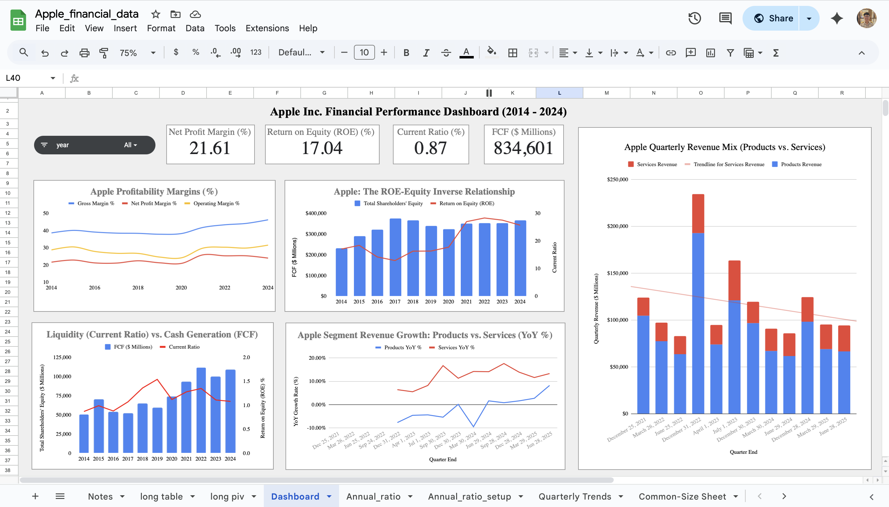
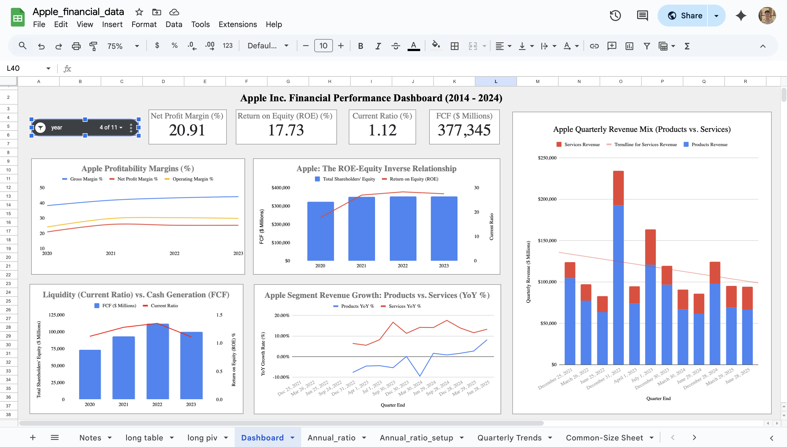

# Quantitative-Financial-Analysis-Apple-Inc.-AAPL-

# Goal 
This project uses Python and specialized financial APIs to conduct a comprehensive Quantitative Financial Analysis of Apple Inc.'s (AAPL) performance over a decade (2014-2024). The primary goal is to dissect the company's financial strategy, identify key growth engines (Services), and quantify the impact of its aggressive capital allocation strategy (Share Buybacks) to inform a strategic investment recommendation.

---

# Background
Apple Inc. has transitioned from a high-growth product company to a mature, high-margin ecosystem company. Understanding this shift requires moving beyond simple revenue growth figures to analyzing financial structure, operational efficiency, and capital deployment.

This analysis addresses critical investor questions:

Profitability: Is the Services revenue growth truly translating into higher margins?

Capital Strategy: How has the massive share buyback program fundamentally altered the balance sheet and what does the resulting Return on Equity (ROE) figure truly signify?

Growth Drivers: Which segments (Products vs. Services) are driving revenue stability and growth, and how does seasonality impact performance?

By systematically calculating and visualizing core metrics—including ROE Decomposition, Free Cash Flow (FCF) trends, and Common-Size analysis—this project provides a granular, data-driven foundation for assessing Apple's long-term financial health and valuation.

---

# Executive Summary 
The analysis reveals that Apple's financial narrative is defined by increasing operational efficiency and an aggressive, highly successful capital return strategy.

## 1. Profitability and Growth Engines

- Margin Expansion: Apple’s Gross Margin has demonstrated a strong upward trend, moving from the ≈38% range pre-2020 to over 46% in 2024. This expansion is the most powerful indicator of increasing pricing power and the growing financial impact of the high-margin Services division.

- Operational Efficiency: The Operating Margin has rebounded sharply from a low in 2020 to over 31% in 2024, showcasing a significant and sustained increase in operational cost control relative to revenue growth.

## 2. Capital Structure and Shareholder Returns

- ROE Inflation via Buybacks: The Return on Equity (ROE) has nearly doubled from the mid-teens to the high $20%$s. This surge is directly attributable to the deliberate reduction of Total Shareholders' Equity (which dropped from a high of ≈$375B to ≈$231B) through massive share buyback programs. This strategy leverages debt to financially engineer an impressive ROE metric.

- Cash Power: Despite the aggressive buyback program, Apple maintains massive Free Cash Flow (FCF), consistently generating between ≈$50B and ≈$110B annually, validating its capacity to sustain dividends and debt obligations.

## 3. Business Stability and Future Growth

- Services Stabilization: Quarterly analysis shows that Services Revenue is the stability engine. Its contribution to total revenue has steadily grown, reaching nearly 30% during non-holiday quarters (e.g., June 2025). This high-margin stream offsets the natural volatility and seasonality of the hardware business.

- Seasonality Risk: Revenue remains highly seasonal, with the December quarter consistently generating massive spikes (e.g., ≈$124B), primarily driven by the iPhone/holiday cycle. This seasonality must be factored into any short-term forecasting.

---

# Insights Summary
The analysis reveals that Apple's financial narrative is defined by a successful shift toward high-margin recurring revenue, aggressive capital management, and increasing operational efficiency across the decade.

## 1. Profitability and Segmental Shift

- Gross Margin Expansion is Unprecedented: The Gross Margin has demonstrated a strong, near-uninterrupted upward trend, rising from the ≈38% range pre-2020 to over 46% in 2024. This expansion signals superior pricing power and successful margin contribution from the Services business.

- Operational Efficiency Rebound: Operating Margin shows a major recovery, dipping to a low of ≈24% in 2020 but rebounding sharply to over 31% in 2024. This indicates effective cost control (SG&A and R&D) relative to revenue growth in recent years.

- Services is the Stabilizer: Quarterly data confirms Services Revenue is both a growth engine and a stability provider. It consistently grows quarter-over-quarter, and its proportional contribution to total revenue increases significantly during non-holiday quarters (e.g., reaching nearly 30% in the projected June 2025 quarter).

## 2. Capital Structure and ROE Manipulation

- ROE is Artificially Inflated: The company's massive rise in Return on Equity (ROE)—from the low-teens to the high $20%$s—is primarily a function of aggressive financial engineering.

- Shrinking Equity Base: This high ROE is achieved by deliberately reducing the denominator (Total Shareholders' Equity) through multi-billion dollar share buyback programs, which saw the equity base drop from a high of ≈$375 billion to ≈$231 billion in 2024. This strategy maximizes returns for remaining shareholders.

## 3. Liquidity and Cash Generation

- Massive FCF, Maturing Growth: Free Cash Flow (FCF) remains immense, consistently providing ≈$50 billion to ≈$110 billion in available cash annually. However, the trend shows a maturing cash generation profile with FCF levels in the early 2010s often exceeding those of the post-2020 period, despite much lower revenue.

- Tight Liquidity Management: Apple intentionally runs a tight liquidity profile. The Current Ratio mostly hovers around 1.10 to 1.30, which is low for a company of its size but reflects a deliberate strategy to minimize idle cash and ensure assets are working as hard as possible.

---

# Recommendations
Based on the quantitative analysis of Apple's financial health, structure, and strategy, the following recommendations are proposed for investors and strategic analysts:

## 1. Re-evaluate Valuation Metrics

- Adjust ROE Interpretation: Investors should be cautious about placing primary weight on Apple's high Return on Equity (ROE). Since the metric is significantly boosted by the shrinking equity base (due to buybacks), it should be interpreted as a measure of capital allocation aggression rather than pure organic efficiency.

- Prioritize FCF/Services: Valuation should place greater emphasis on the growth trajectory and predictability of Services Revenue and the stability of Free Cash Flow (FCF). These are the true indicators of organic value creation and long-term dividend sustainability.

## 2. Monitor FCF and Operational Growth

- FCF Trend Monitoring: While FCF is massive, the analysis shows a maturing cash generation profile. Future FCF growth should be monitored carefully against revenue growth to ensure the massive scale of the company is still translating into efficient cash conversion.

- Operational Margin Focus: Pay close attention to the Operating Margin. Maintaining this above the ≈30% threshold is critical, as any future erosion would signal a failure to control operating expenses (SG&A, R&D) against the backdrop of increasing revenue and margin pressure.

## 3. Strategic Insight on Liquidity

- Maintain Liquidity Posture: Apple's intentionally low Current Ratio (hovering around 1.10) should not be viewed as a risk. It is a calculated strategy to minimize non-working assets. The company's massive FCF pipeline provides sufficient, reliable short-term liquidity, justifying this efficient, debt-leveraged approach.

---

# Dashboard: Apple Inc. Financial Performance (2014–2024)

This interactive dashboard provides a comprehensive overview of Apple’s financial performance over the past decade, highlighting profitability, growth, liquidity, and revenue composition between products and services.

This interactive dashboard provides a comprehensive overview of Apple’s financial performance over the past decade, highlighting profitability, growth, liquidity, and revenue composition between products and services.
The dashboard features the following components:
- Key Financial KPIs: Summary cards display Apple’s latest Net Profit Margin, Return on Equity (ROE), Current Ratio, and Free Cash Flow (FCF), offering an at-a-glance view of overall performance.
- Profitability Trends: A line chart tracks Gross, Operating, and Net Profit Margins over time, showcasing Apple’s efficiency in managing costs and sustaining profits.
- ROE vs Equity Relationship: A dual-axis chart illustrates the inverse relationship between shareholder equity and ROE, emphasizing how capital structure impacts returns.
- Liquidity vs Cash Generation: A comparison of Current Ratio and FCF reveals Apple’s ability to balance short-term obligations with strong cash generation.
- Segment Revenue Growth: A YoY growth chart contrasts Products vs Services, highlighting the increasing role of services in Apple’s revenue mix.
- Quarterly Revenue Mix: A bar chart breaks down quarterly revenues by Products and Services, with a trendline underscoring the shifting composition of Apple’s income sources.
- This dashboard enables clear storytelling around Apple’s evolving financial health, investor returns, and strategic pivot toward services.

The full spreadsheet can be accessed [here](https://docs.google.com/spreadsheets/d/1bBbz_vUn7sLMHjyvH9wTFusqY_liPMgdXBQ_yj9SZYE/edit?usp=sharing).

1. Dashboard sample

2. Dashboard sample displayed as filtered data

---

# Challenges Faced and Solutions

## 1. Data Compatibility and Schema Normalization

- Challenge: The raw financial data extracted from SEC filings via the Edgar Tool was highly inconsistent. Line items for the same metric (e.g., "Revenue," "Total Revenue," or "Net Sales") varied in naming and position across different annual and quarterly filing formats (10-K, 10-Q) over the 10-year period.

- Solution: I addressed this by performing financial data mapping and normalization. Initial Python (Pandas) scripts were developed to consolidate documents, followed by manual reconciliation and XLOOKUP methods in Excel to align disparate historical line items into the four required consistent tables (Annual Ratios, Quarterly Trends, etc.). This established a stable, unified time-series dataset.

## 2. Handling Sparse Quarterly Segment Data

- Challenge: The initial quarterly data extraction contained large blocks of zero values for segment revenues (e.g., Products Revenue and Services Revenue were zeroed out for many quarters before 2021). This prevented a complete long-term quarterly analysis of the segment shift.

- Solution: The visualization was strategically adjusted to focus on the period where segment reporting was consistently itemized (starting December 2021). This focused approach provided the most recent and relevant insights, cleanly demonstrating the Services growth trajectory without relying on historical imputation.

## 3. Complexity of Advanced Financial Visualization

- Challenge: Key insights, such as the inverse relationship between ROE and Total Shareholders' Equity and the relationship between FCF and Liquidity, could not be effectively shown using single-axis plots.

- Solution: I leveraged Python's Matplotlib to create dual-axis charts. This technique allowed for the simultaneous plotting of metrics with vastly different scales (e.g., billions of dollars vs. percentage points or ratios), clearly illustrating the cause-and-effect financial relationships to support the key findings.

---

# Spreadsheet samples

Here are some snapshots of my spreadsheet used in this project. The full spreadsheet can be accessed [here](https://docs.google.com/spreadsheets/d/1bBbz_vUn7sLMHjyvH9wTFusqY_liPMgdXBQ_yj9SZYE/edit?usp=sharing)

1. Sample of the annual ratio calculation sheet

2. Data Transformation: Wide-to-Long Pivot. This crucial transformation allows all visualizations to be driven by a single filter (e.g., Year or Segment).

---

# Technologies Used
- Python: Core programming language used for scripting and data handling such as data reading, cleaning, preparation before transfer to Google Sheets and  converting from a wide table to a long table.
- EDGAR Tool/API Script: Automated retrieval of raw financial data (10-K and 10-Q filings) from the SEC EDGAR system.
- Google Sheets / Microsoft Excel: Primary tool for data normalization, cleaning, creating helper columns, and calculating all financial ratios as well as creation of all final, high-impact visualizations.
- GitHub: Repository hosting and final presentation of the analysis, data snapshots, and dashboard charts.

---

# Author

Mr. Pakkapol Satthapiti | MSC of Data Science and AI | The University of Liverpool | Feel free to connect!